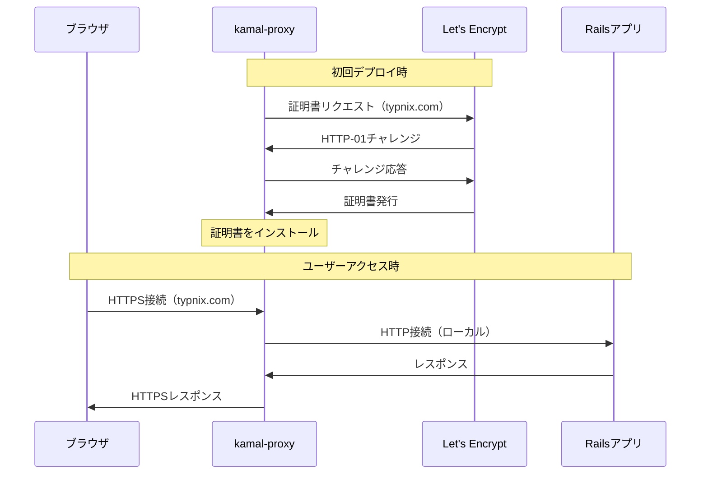
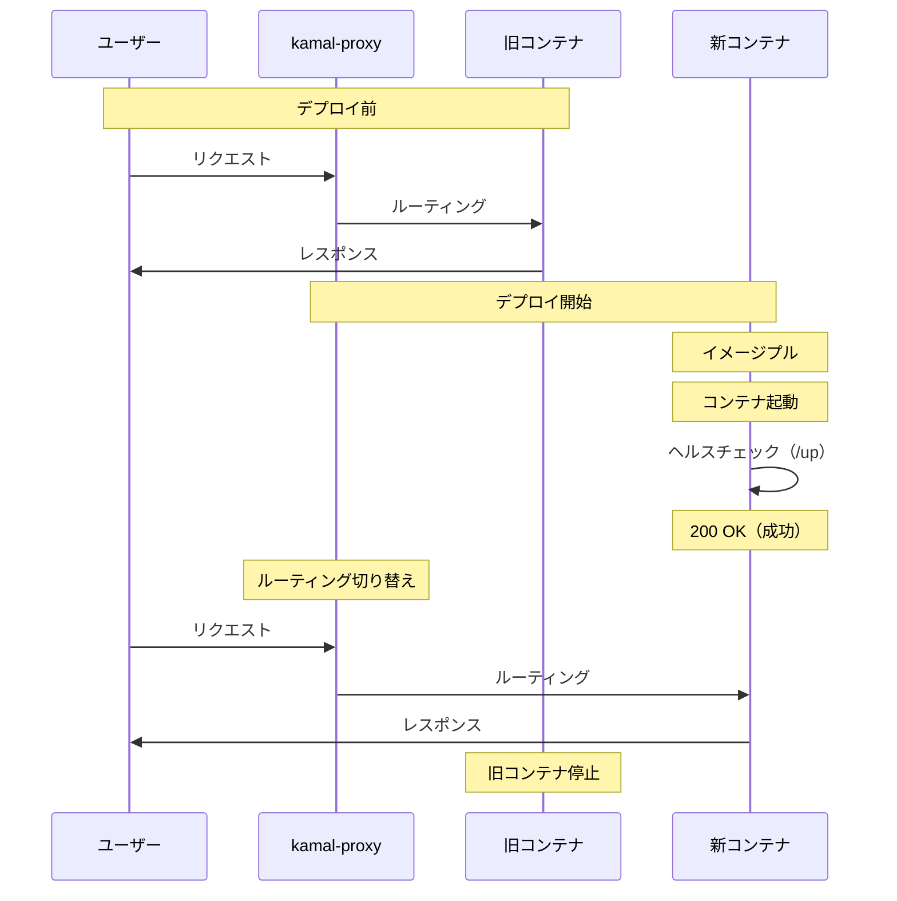

# Review Test #11: Kamalによるモダンなデプロイフロー

**難易度**: 🟡🔴 中級〜上級
**推定時間**: 30分〜1時間
**学習トピック**: [Kamalによるモダンなデプロイフロー](../topics/03_advanced/11_kamal_deployment.md)

---

## 前提条件

あなたはFlexitypeプロジェクトのコードレビュアーです。
以下のPRがレビュー待ちになっています。

## PR概要

- **タイトル**: Kamalによる本番環境デプロイ実装（独自ドメイン + SSL対応）
- **変更ファイル数**: 5ファイル
- **目的**: さくらVPSへのデプロイ環境を構築し、独自ドメイン（typnix.com）でHTTPS公開を実現する

## 変更内容

### 1. `config/deploy.yml` (新規作成)

```yaml
service: flexitype
image: flexitype

servers:
  web:
    - 153.120.65.157

# Full SSL設定: kamal-proxyがLet's Encryptで自動的にSSL証明書を取得
# CloudflareのSSL/TLS暗号化モードは「Full」に設定すること
proxy:
  ssl: true
  host: typnix.com

registry:
  server: localhost:5555

env:
  secret:
    - RAILS_MASTER_KEY
    - FLEXITYPE_DATABASE_PASSWORD
    - ADMIN_EMAILS
    - ALLOWED_EMAILS
    - GTM_CONTAINER_ID
  clear:
    SOLID_QUEUE_IN_PUMA: false
    DB_HOST: 153.120.65.157
    RAILS_LOG_LEVEL: info

aliases:
  console: app exec --interactive --reuse "bin/rails console"
  shell: app exec --interactive --reuse "bash"
  logs: app logs -f
  dbc: app exec --interactive --reuse "bin/rails dbconsole --include-password"

volumes:
  - "flexitype_storage:/rails/storage"

asset_path: /rails/public/assets

builder:
  arch: amd64

ssh:
  user: ubuntu
```

**約129行のコード**

### 2. `.kamal/secrets.example` (新規作成)

```bash
# ========================================
# セキュリティ関連（最重要）
# ========================================

# 管理者のメールアドレス（カンマ区切り）
ADMIN_EMAILS=admin@example.com,official@example.com

# ========================================
# データベース関連
# ========================================

# PostgreSQLデータベースのパスワード
FLEXITYPE_DATABASE_PASSWORD=your_database_password_here

# ========================================
# Rails暗号化
# ========================================

# Rails暗号化キー（config/master.key の内容）
RAILS_MASTER_KEY=your_rails_master_key_here

# ========================================
# アクセス制御
# ========================================

# ログイン許可するメールアドレス（カンマ区切り）
ALLOWED_EMAILS=user1@example.com,user2@example.com,official@example.com

# ========================================
# 外部サービス
# ========================================

# Google Tag Manager コンテナID
GTM_CONTAINER_ID=GTM-XXXXXXX
```

**約48行のコード**

### 3. `config/environments/production.rb` (既存)

```ruby
# config/environments/production.rb（抜粋）

# CloudflareプロキシとLet's Encryptによるエンドツーエンド暗号化を有効化
config.assume_ssl = true   # プロキシ経由でSSL接続されていると仮定
config.force_ssl = true    # すべてのアクセスをHTTPSに強制
```

**2行の変更**

### 4. `config/database.yml` (既存)

```yaml
# config/database.yml（抜粋）

production:
  primary:
    adapter: postgresql
    encoding: unicode
    pool: <%= ENV.fetch("RAILS_MAX_THREADS") { 5 } %>
    host: <%= ENV.fetch("DB_HOST") { "localhost" } %>
    port: <%= ENV.fetch("DB_PORT") { 5432 } %>
    database: flexitype_production
    username: flexitype
    password: <%= ENV['FLEXITYPE_DATABASE_PASSWORD'] %>

  cache:
    adapter: postgresql
    encoding: unicode
    pool: <%= ENV.fetch("RAILS_MAX_THREADS") { 5 } %>
    host: <%= ENV.fetch("DB_HOST") { "localhost" } %>
    port: <%= ENV.fetch("DB_PORT") { 5432 } %>
    database: flexitype_production_cache
    username: flexitype
    password: <%= ENV['FLEXITYPE_DATABASE_PASSWORD'] %>

  queue:
    adapter: postgresql
    encoding: unicode
    pool: <%= ENV.fetch("RAILS_MAX_THREADS") { 5 } %>
    host: <%= ENV.fetch("DB_HOST") { "localhost" } %>
    port: <%= ENV.fetch("DB_PORT") { 5432 } %>
    database: flexitype_production_queue
    username: flexitype
    password: <%= ENV['FLEXITYPE_DATABASE_PASSWORD'] %>

  cable:
    adapter: postgresql
    encoding: unicode
    pool: <%= ENV.fetch("RAILS_MAX_THREADS") { 5 } %>
    host: <%= ENV.fetch("DB_HOST") { "localhost" } %>
    port: <%= ENV.fetch("DB_PORT") { 5432 } %>
    database: flexitype_production_cable
    username: flexitype
    password: <%= ENV['FLEXITYPE_DATABASE_PASSWORD'] %>
```

**hostとportを環境変数化**

### 5. `docs/DEPLOY_GUIDE.md` (新規作成)

```markdown
# デプロイガイド

## 概要

このドキュメントは、TypnixアプリケーションをさくらVPSにデプロイするための手順をまとめたものです。

## 前提条件

### ローカル環境
- Ruby 3.4.4
- Docker（イメージビルド用）
- Kamal 2.9.0以上

### サーバー環境（さくらVPS）
- Ubuntu 22.04 LTS以上
- Docker Engine インストール済み
- PostgreSQL インストール済み
- SSH接続設定済み

## 必要な環境変数

### 1. RAILS_MASTER_KEY
- **用途**: Rails credentialsの暗号化キー
- **取得方法**: `config/master.key` の内容
- **設定場所**: `.kamal/secrets` ファイル

### 2. FLEXITYPE_DATABASE_PASSWORD
- **用途**: PostgreSQLデータベースのパスワード
- **設定場所**: `.kamal/secrets` ファイル、VPSのPostgreSQL設定

（以下省略）
```

**約310行のコード**

---

## レビュー課題

### Q1. Kamalの基本理解（初級）🟢

以下の質問に答えてください。

1. Kamalとは何か？従来のデプロイツール（Capistrano、Herokuなど）と比較して、どのような利点があるか？
2. ゼロダウンタイムデプロイとは何か？Kamalはどのように実現しているか？
3. ヘルスチェックエンドポイント（`/up`）の役割は何か？なぜデプロイフローにおいて重要なのか？

**回答時間の目安**: 5分

<details>
<summary>解答を表示</summary>

### A1. Kamalの基本理解

**1. Kamalとは何か？従来のデプロイツールとの比較:**

Kamalは、37signals（Basecampの開発元）が開発した、**Dockerコンテナベースのモダンなデプロイツール**です。

**従来のデプロイツールとの比較:**

| 特徴 | Kamal | Capistrano | Heroku |
|------|-------|-----------|--------|
| **設定の簡潔さ** | ✅ 1ファイル（deploy.yml） | ❌ 複雑（deploy.rb、Nginx、Puma、systemd） | ✅ 簡単 |
| **ダウンタイム** | ✅ ゼロダウンタイム | ❌ 数秒〜数十秒のダウンタイム | ✅ ゼロダウンタイム |
| **SSL証明書** | ✅ Let's Encrypt自動取得・更新 | ❌ 手動設定（cron jobなど） | ✅ 自動 |
| **コスト** | ✅ VPS（月額1,000円〜） | ✅ VPS（月額1,000円〜） | ❌ 月額$25〜$250 |
| **カスタマイズ性** | ✅ 高い | ✅ 高い | ❌ 低い（Heroku仕様に縛られる） |
| **ロールバック** | ✅ 簡単（bin/kamal rollback） | ❌ 手動で前のバージョンに戻す | ✅ 簡単（heroku rollback） |

**Kamalの主な利点:**
- **シンプルな設定**: `config/deploy.yml` 1ファイルで完結
- **ゼロダウンタイム**: ローリングデプロイ方式
- **Dockerネイティブ**: 環境の再現性が高い
- **SSL自動化**: Let's Encryptで証明書を自動取得・更新
- **コスト削減**: Herokuの1/10以下のコスト

**2. ゼロダウンタイムデプロイとは？Kamalの実現方法:**

ゼロダウンタイムデプロイとは、**デプロイ中もサービスが継続して稼働し、ユーザーに影響を与えない**デプロイ方式です。

**Kamalの実現方法（ローリングデプロイ）:**

1. **新しいコンテナをデプロイ**: 旧コンテナを動かしたまま、新しいコンテナを起動
2. **ヘルスチェック**: 新しいコンテナの`/up`エンドポイントにアクセス
3. **ヘルスチェック成功**: 新しいコンテナが正常に起動したことを確認
4. **ルーティング切り替え**: kamal-proxyが、旧コンテナから新しいコンテナへルーティングを切り替え
5. **旧コンテナ停止**: 新しいコンテナへの切り替えが完了したら、旧コンテナを停止

**ヘルスチェック失敗時の挙動:**
- 新しいコンテナのヘルスチェックが失敗した場合、ルーティングを切り替えない
- 旧コンテナのまま稼働を継続（ダウンタイムゼロ）
- 開発者はログを確認して、デプロイ失敗の原因を調査

**3. ヘルスチェックエンドポイント（`/up`）の役割:**

ヘルスチェックエンドポイントは、**アプリケーションが正常に起動しているかを確認する**ためのエンドポイントです。

**役割:**
- データベース接続の確認
- Railsアプリケーションの起動確認
- 必要なサービス（Redis、外部APIなど）の接続確認

**Railsでの実装:**

```ruby
# config/routes.rb
get "up" => "rails/health#show", as: :rails_health_check

# app/controllers/rails/health_controller.rb（Rails 8標準搭載）
class Rails::HealthController < ActionController::Base
  def show
    # データベース接続をチェック
    ActiveRecord::Base.connection.execute("SELECT 1")
    render plain: "OK", status: :ok
  rescue => e
    render plain: "ERROR: #{e.message}", status: :internal_server_error
  end
end
```

**デプロイフローにおける重要性:**
- ヘルスチェックが成功しない限り、ルーティングを切り替えない（ダウンタイム防止）
- デプロイ失敗時も、旧コンテナのまま稼働を継続
- ユーザーに影響を与えずに、デプロイの成功/失敗を判断できる

</details>

---

### Q2. deploy.ymlの設定理解（中級）🟡

以下の質問に答えてください。

1. `config/deploy.yml`の`env.secret`と`env.clear`の違いは何か？どのような情報をそれぞれに設定すべきか？
2. `proxy.ssl: true`と`proxy.host: typnix.com`の設定により、どのような動作が実現されるか？Let's Encryptとの関係を含めて説明してください。
3. `DB_HOST: 153.120.65.157`という設定がある理由は何か？なぜ`localhost`ではダメなのか？Dockerネットワーキングの観点から説明してください。

**回答時間の目安**: 10分

<details>
<summary>解答を表示</summary>

### A2. deploy.ymlの設定理解

**1. `env.secret`と`env.clear`の違い:**

| 設定 | 読み込み元 | Git管理 | 用途 | 例 |
|------|----------|--------|------|---|
| **`env.secret`** | `.kamal/secrets` | ❌ 管理外 | 機密情報 | パスワード、API キー、メールアドレス |
| **`env.clear`** | `config/deploy.yml` | ✅ 管理内 | 公開情報 | IPアドレス、ログレベル、ホスト名 |

**設定すべき情報の分類:**

**`env.secret`に設定すべき情報:**
- `RAILS_MASTER_KEY`（Rails credentialsの暗号化キー）
- `FLEXITYPE_DATABASE_PASSWORD`（データベースパスワード）
- `ADMIN_EMAILS`（管理者メールアドレス）
- `ALLOWED_EMAILS`（ログイン許可メールアドレス）
- `GTM_CONTAINER_ID`（Google Tag Manager ID）
- `GOOGLE_ADSENSE_PUBLISHER_ID`（AdSense ID）

**`env.clear`に設定すべき情報:**
- `DB_HOST`（VPSのIPアドレス）
- `RAILS_LOG_LEVEL`（ログレベル: info、warn など）
- `SOLID_QUEUE_IN_PUMA`（機能フラグ: true/false）

**セキュリティ上の注意:**
- `.kamal/secrets` は `.gitignore` に含めて、**絶対にGitにコミットしない**
- 機密情報を `env.clear` に設定すると、Git履歴に残ってしまう
- チーム開発では、`.kamal/secrets.example` でテンプレートを提供

**2. `proxy.ssl: true`と`proxy.host: typnix.com`の設定による動作:**

この設定により、以下の動作が実現されます：

**kamal-proxyの動作:**
1. **SSL証明書の自動取得**: Let's EncryptのHTTP-01チャレンジで証明書をリクエスト
2. **ドメイン所有権の確認**: `typnix.com`のDNS設定が正しいか確認
3. **証明書のインストール**: kamal-proxyに証明書を配置
4. **HTTPS通信の開始**: ブラウザ → kamal-proxy間でHTTPS通信
5. **自動更新**: 証明書の有効期限（90日）が近づくと、自動的に更新

**ホストベースルーティング:**
- `proxy.host: typnix.com` により、このホスト名でのみルーティング
- `https://typnix.com/` → Railsアプリにルーティング ✅
- `http://153.120.65.157/` → 404エラー ❌（ホスト名が一致しない）

**Let's Encryptとの関係:**



**Cloudflareとの組み合わせ（エンドツーエンド暗号化）:**
- CloudflareのSSL/TLS暗号化モード: **Full**
- ブラウザ → Cloudflare: HTTPS（Cloudflare証明書）
- Cloudflare → VPS: HTTPS（Let's Encrypt証明書）
- VPS → Railsアプリ: HTTP（ローカル通信）

**3. `DB_HOST: 153.120.65.157`の理由:**

**問題点: `localhost`を使用した場合**

Dockerコンテナ内の`localhost`は、**コンテナ自身を指す**ため、VPS上のPostgreSQLに接続できません。

```
┌─────────────────────────────────────┐
│ VPS（153.120.65.157）                │
│                                     │
│  ┌───────────────────────────┐     │
│  │ Dockerコンテナ              │     │
│  │ （Railsアプリ）               │     │
│  │                            │     │
│  │ localhost → 172.17.0.2     │     │
│  │ ❌ VPSのPostgreSQLに接続できない │
│  └───────────────────────────┘     │
│                                     │
│  ┌───────────────────────────┐     │
│  │ PostgreSQL                  │     │
│  │ （VPSホスト上で稼働）          │     │
│  │ localhost → 153.120.65.157 │     │
│  └───────────────────────────┘     │
└─────────────────────────────────────┘
```

**解決策: VPSのIPアドレスを使用**

```yaml
# config/deploy.yml（正しい設定）
env:
  clear:
    DB_HOST: 153.120.65.157  # ✅ VPSのIPアドレスを指定
```

```
┌─────────────────────────────────────┐
│ VPS（153.120.65.157）                │
│                                     │
│  ┌───────────────────────────┐     │
│  │ Dockerコンテナ              │     │
│  │ （Railsアプリ）               │     │
│  │                            │     │
│  │ DB_HOST=153.120.65.157     │     │
│  │ ✅ VPSのPostgreSQLに接続できる  │
│  └───────────────────────────┘     │
│              ↑                      │
│              │ TCP接続               │
│              ↓                      │
│  ┌───────────────────────────┐     │
│  │ PostgreSQL                  │     │
│  │ （VPSホスト上で稼働）          │     │
│  │ listen_addresses = '*'      │     │
│  └───────────────────────────┘     │
└─────────────────────────────────────┘
```

**PostgreSQL側の設定も必要:**

```bash
# /etc/postgresql/14/main/pg_hba.conf
# Dockerネットワークからの接続を許可
host    all             all             172.16.0.0/12           md5

# /etc/postgresql/14/main/postgresql.conf
listen_addresses = '*'  # すべてのIPアドレスからの接続をリッスン
```

**Dockerネットワーキングの概念:**
- Dockerコンテナは、`172.16.0.0/12`の範囲でIPアドレスを取得
- コンテナ内の`localhost`は、コンテナ自身のIPアドレス（例: 172.17.0.2）
- ホストマシン（VPS）のサービスに接続するには、ホストのIPアドレスを使用

</details>

---

### Q3. デプロイフローの理解（中級〜上級）🟡🔴

以下の質問に答えてください。

1. `bin/kamal setup`と`bin/kamal deploy`の違いは何か？それぞれどのような場合に使用するか？
2. ヘルスチェックが失敗した場合、Kamalはどのような挙動をするか？旧コンテナはどうなるか？
3. ローリングデプロイの仕組みを、kamal-proxyのルーティング切り替えの観点から説明してください。

**回答時間の目安**: 15分

<details>
<summary>解答を表示</summary>

### A3. デプロイフローの理解

**1. `bin/kamal setup`と`bin/kamal deploy`の違い:**

| コマンド | 用途 | 実行内容 | タイミング |
|---------|------|----------|----------|
| **`bin/kamal setup`** | 初回セットアップ | - kamal-proxyのインストール<br>- レジストリの起動<br>- イメージビルド<br>- イメージプッシュ<br>- データベースマイグレーション<br>- コンテナ起動 | VPSへの初回デプロイ |
| **`bin/kamal deploy`** | 通常のデプロイ | - イメージビルド<br>- イメージプッシュ<br>- ローリングデプロイ<br>- ヘルスチェック<br>- ルーティング切り替え | コード変更後のデプロイ |

**`bin/kamal setup`の実行内容（詳細）:**

```bash
# 1. kamal-proxyのインストール
# VPS上にkamal-proxyコンテナをデプロイ（Nginxの代替）

# 2. ローカルレジストリの起動
# localhost:5555でDockerレジストリを起動（イメージ保存用）

# 3. イメージビルド
# ローカル環境でDockerイメージをビルド

# 4. イメージプッシュ
# ビルドしたイメージをVPSのレジストリにプッシュ

# 5. データベースマイグレーション
# bin/rails db:migrate を実行（初回のみ）

# 6. コンテナ起動
# Railsアプリのコンテナを起動
```

**`bin/kamal deploy`の実行内容（詳細）:**

```bash
# 1. イメージビルド
# 最新のコードでDockerイメージをビルド

# 2. イメージプッシュ
# ビルドしたイメージをVPSのレジストリにプッシュ

# 3. ローリングデプロイ
# 旧コンテナを動かしたまま、新しいコンテナを起動

# 4. ヘルスチェック
# 新しいコンテナの/upエンドポイントにアクセス

# 5. ルーティング切り替え
# ヘルスチェック成功後、kamal-proxyのルーティングを切り替え

# 6. 旧コンテナ停止
# 新しいコンテナへの切り替えが完了したら、旧コンテナを停止
```

**使用場面:**

**`bin/kamal setup`を使用する場合:**
- VPSへの初回デプロイ
- kamal-proxyを再インストールする場合
- レジストリを再構築する場合

**`bin/kamal deploy`を使用する場合:**
- コード変更後のデプロイ（通常のデプロイ）
- 環境変数を変更した場合（`.kamal/secrets`の更新後）
- Gemfile更新後のデプロイ

**`bin/kamal app boot`を使用する場合:**
- 環境変数のみを変更した場合（イメージビルド不要）
- コンテナを再起動したい場合

**2. ヘルスチェック失敗時のKamalの挙動:**

ヘルスチェックが失敗した場合、Kamalは以下の挙動をします：

**挙動:**
1. **新しいコンテナをデプロイ**: 旧コンテナを動かしたまま、新しいコンテナを起動
2. **ヘルスチェック**: 新しいコンテナの`/up`エンドポイントにアクセス
3. **ヘルスチェック失敗**: レスポンスが200 OK以外（500 Internal Server Error など）
4. **ルーティング切り替えをスキップ**: kamal-proxyは、旧コンテナのままルーティングを継続
5. **新しいコンテナを停止**: ヘルスチェック失敗の新しいコンテナを停止
6. **デプロイ失敗を報告**: エラーメッセージを表示、開発者にログ確認を促す

**旧コンテナの状態:**
- **引き続き稼働**: ヘルスチェック失敗時も、旧コンテナはそのまま稼働
- **ダウンタイムゼロ**: ユーザーに影響を与えない
- **ロールバック不要**: 旧コンテナのまま稼働しているため、ロールバック操作は不要

**デバッグ方法:**

```bash
# 1. ログ確認
bin/kamal app logs

# 2. コンテナの状態確認
ssh ubuntu@153.120.65.157
docker ps -a

# 3. 新しいコンテナのログ確認
docker logs flexitype-web-<container-id>

# 4. ヘルスチェックエンドポイントの手動テスト
curl http://localhost/up
```

**ヘルスチェック失敗の原因例:**
- データベース接続エラー
- 環境変数の設定ミス
- Gemfileの依存関係エラー
- アセットコンパイルエラー

**Day 13の実例:**

> データベース接続エラーが発生し、ヘルスチェックが失敗。旧コンテナのまま稼働を継続し、ダウンタイムゼロを実現。ログを確認して、DB_HOSTの設定ミスを発見・修正。

**3. ローリングデプロイの仕組み（kamal-proxyのルーティング切り替え）:**

ローリングデプロイは、**kamal-proxyのルーティング切り替え**により実現されます。

**フロー:**



**詳細ステップ:**

**Step 1: デプロイ前の状態**
- kamal-proxyは、旧コンテナ（例: `flexitype-web-001`）にルーティング
- ユーザーのリクエストは、旧コンテナで処理

**Step 2: 新しいコンテナの起動**
- 最新のイメージでコンテナ（例: `flexitype-web-002`）を起動
- 旧コンテナは**引き続き稼働**（この時点ではルーティングされていない）

**Step 3: ヘルスチェック**
- kamal-proxyは、新しいコンテナの`/up`エンドポイントにアクセス
- レスポンスが200 OKの場合、ヘルスチェック成功
- レスポンスが200 OK以外の場合、ヘルスチェック失敗（ルーティング切り替えをスキップ）

**Step 4: ルーティング切り替え**
- ヘルスチェック成功後、kamal-proxyはルーティングを切り替え
- 新しいリクエストは、新しいコンテナ（`flexitype-web-002`）にルーティング
- 旧コンテナで処理中のリクエストは、そのまま完了まで処理（中断しない）

**Step 5: 旧コンテナ停止**
- すべてのリクエストが新しいコンテナにルーティングされたことを確認
- 旧コンテナを停止（`docker stop flexitype-web-001`）
- イメージを削除（ディスク容量節約）

**kamal-proxyのルーティングテーブル:**

| タイミング | ホスト | ターゲット |
|----------|-------|----------|
| デプロイ前 | typnix.com | flexitype-web-001（旧コンテナ） |
| ヘルスチェック中 | typnix.com | flexitype-web-001（旧コンテナ）<br>※新コンテナはまだルーティングされない |
| ヘルスチェック成功後 | typnix.com | flexitype-web-002（新コンテナ） |

**ダウンタイムゼロの保証:**
- 旧コンテナを動かしたまま、新しいコンテナをデプロイ
- ヘルスチェック成功後のみ、ルーティングを切り替え
- 旧コンテナで処理中のリクエストは、中断せず完了まで処理
- ユーザーに影響を与えない

**ヘルスチェック失敗時の挙動:**
- ルーティング切り替えをスキップ
- 旧コンテナのままルーティングを継続
- 新しいコンテナを停止
- ダウンタイムゼロを維持

</details>

---

### Q4. トラブルシューティングと設計判断（上級）🔴

あなたはデプロイ後に以下の問題に遭遇しました。それぞれの問題について、原因と解決方法を説明してください。

**問題1**: デプロイ後、ブラウザで`https://typnix.com/`にアクセスすると、「接続がタイムアウトしました」エラーが表示される。VPS内部からは`curl http://localhost/up`で200 OKが返る。

**問題2**: `bin/kamal deploy`を実行すると、「データベース接続エラー」が発生し、デプロイが失敗する。ローカル環境では正常に動作している。

**問題3**: PostgreSQLをVPS内で稼働させる vs 外部サービス（Amazon RDS、Google Cloud SQLなど）を使用する場合の判断基準は何か？それぞれのメリット・デメリットを説明してください。

**回答時間の目安**: 10分

<details>
<summary>解答を表示</summary>

### A4. トラブルシューティングと設計判断

#### 問題1: 外部アクセスでタイムアウト、VPS内部では正常

**症状:**
- ブラウザで`https://typnix.com/`にアクセス → 接続がタイムアウト
- VPS内部で`curl http://localhost/up` → 200 OK

**原因の候補:**

**1. ファイアウォール設定（最も可能性が高い）**

さくらVPSでは、**OS側（ufw）とコントロールパネル側（パケットフィルタ）の両方**を設定する必要があります。

**チェック方法:**

```bash
# VPSにSSH接続
ssh ubuntu@153.120.65.157

# OS側のファイアウォール確認
sudo ufw status

# 以下が表示されるべき
# 80/tcp                     ALLOW       Anywhere
# 443/tcp                    ALLOW       Anywhere
```

**解決方法:**

```bash
# OS側のファイアウォール設定
sudo ufw allow 80/tcp    # HTTP
sudo ufw allow 443/tcp   # HTTPS
sudo ufw enable
```

さらに、**さくらVPSのコントロールパネル**で、パケットフィルタを設定します。

1. さくらVPSコントロールパネルにログイン
2. 「パケットフィルタ」を選択
3. 「Webルール」を追加（80, 443番ポート）
4. 設定を反映

**2. CloudflareのSSL/TLS設定が誤っている**

**チェック方法:**

Cloudflareの「SSL/TLS」→「概要」で、暗号化モードを確認。

**解決方法:**

- 暗号化モード: **Full**（Cloudflare ↔ VPS間もHTTPS）
- FlexibleまたはOffの場合は、Fullに変更

**3. kamal-proxyのホストベースルーティング設定**

**チェック方法:**

```yaml
# config/deploy.yml
proxy:
  ssl: true
  host: typnix.com  # ホスト名が正しいか確認
```

**解決方法:**

- `proxy.host`が正しいドメイン名になっているか確認
- IPアドレス直接アクセス（`http://153.120.65.157/`）は404になる（正常な動作）

**Day 13の実例:**

> さくらVPSのパケットフィルタで80/443ポートが閉じていたため、外部アクセスができなかった。OS側のufwは開けていたが、コントロールパネル側の設定が不足。さくらVPSでは、OS側とコントロールパネル側の両方を設定する必要がある。

---

#### 問題2: データベース接続エラー、ローカル環境では正常

**症状:**
- `bin/kamal deploy`を実行 → データベース接続エラー
- ローカル環境（`rails s`）では正常に動作

**原因の候補:**

**1. DB_HOSTの設定が誤っている**

Dockerコンテナ内の`localhost`は、コンテナ自身を指すため、VPS上のPostgreSQLに接続できません。

**チェック方法:**

```yaml
# config/deploy.yml
env:
  clear:
    DB_HOST: localhost  # ❌ 誤った設定
```

**解決方法:**

```yaml
# config/deploy.yml
env:
  clear:
    DB_HOST: 153.120.65.157  # ✅ VPSのIPアドレスを指定
```

**2. PostgreSQLの接続許可設定が不足**

Dockerネットワークからの接続を許可していない可能性があります。

**チェック方法:**

```bash
# VPS上で実行
sudo vim /etc/postgresql/14/main/pg_hba.conf

# 以下の行があるか確認
# host    all             all             172.16.0.0/12           md5
```

**解決方法:**

```bash
# pg_hba.conf編集
sudo vim /etc/postgresql/14/main/pg_hba.conf

# 末尾に追加
host    all             all             172.16.0.0/12           md5

# postgresql.conf編集
sudo vim /etc/postgresql/14/main/postgresql.conf

# 変更
listen_addresses = '*'

# PostgreSQL再起動
sudo systemctl restart postgresql
```

**3. 環境変数（FLEXITYPE_DATABASE_PASSWORD）が設定されていない**

**チェック方法:**

```bash
# .kamal/secrets ファイルを確認
cat .kamal/secrets

# 以下が含まれているか確認
# FLEXITYPE_DATABASE_PASSWORD=your_password_here
```

**解決方法:**

```bash
# .kamal/secrets編集
vim .kamal/secrets

# 追加
FLEXITYPE_DATABASE_PASSWORD=your_password_here

# コンテナ再起動して環境変数を反映
bin/kamal app boot
```

**4. PostgreSQLユーザー・データベースが作成されていない**

**チェック方法:**

```bash
# VPS上で実行
sudo -u postgres psql

-- PostgreSQLコンソール内で実行
\l  -- データベース一覧
\du -- ユーザー一覧
```

**解決方法:**

```bash
sudo -u postgres psql

-- PostgreSQLコンソール内で実行
CREATE USER flexitype WITH PASSWORD 'your_password_here';
CREATE DATABASE flexitype_production OWNER flexitype;
CREATE DATABASE flexitype_production_cache OWNER flexitype;
CREATE DATABASE flexitype_production_queue OWNER flexitype;
CREATE DATABASE flexitype_production_cable OWNER flexitype;
\q
```

**デバッグ手順:**

```bash
# 1. ログ確認
bin/kamal app logs

# 2. Railsコンソールで接続テスト
bin/kamal app exec --interactive --reuse "bin/rails console"

# コンソール内で実行
ActiveRecord::Base.connection.execute("SELECT 1")
# → エラーメッセージを確認

# 3. PostgreSQL接続テスト（VPS上）
ssh ubuntu@153.120.65.157
psql -h 153.120.65.157 -U flexitype -d flexitype_production
# → パスワード入力後、接続できるか確認
```

**Day 13の実例:**

| 問題 | 原因 | 解決方法 |
|------|------|----------|
| データベース接続エラー | Dockerコンテナ内のlocalhostがVPSを指さない | DB_HOSTをVPS IPアドレスに変更 |
| pg_hba.conf接続拒否 | Dockerネットワークからの接続が未許可 | 172.16.0.0/12を許可に追加 |

---

#### 問題3: PostgreSQLをVPS内で稼働 vs 外部サービス（RDS、Cloud SQL）

**判断基準:**

| 項目 | VPS内PostgreSQL | 外部サービス（RDS、Cloud SQL） |
|------|----------------|---------------------------|
| **コスト** | ✅ 低い（VPS料金のみ） | ❌ 高い（月額$20〜） |
| **管理の手間** | ❌ 高い（バックアップ、更新、監視） | ✅ 低い（自動バックアップ、自動更新） |
| **スケーラビリティ** | ❌ 低い（VPSのリソースに依存） | ✅ 高い（簡単にスケールアップ） |
| **高可用性** | ❌ 低い（VPS停止時にDBも停止） | ✅ 高い（マルチAZ、自動フェイルオーバー） |
| **バックアップ** | ❌ 手動設定（cron jobなど） | ✅ 自動バックアップ（ポイントインタイム復元） |
| **パフォーマンス** | ✅ 高い（ローカル接続、レイテンシーゼロ） | ❌ 低い（ネットワーク経由、レイテンシーあり） |
| **セキュリティ** | ❌ 低い（自分で設定） | ✅ 高い（暗号化、VPC、IAM統合） |

**メリット・デメリット:**

**VPS内PostgreSQLのメリット:**
- **コストが低い**: VPS料金（月額1,000円〜）のみで運用可能
- **パフォーマンスが高い**: ローカル接続のため、レイテンシーがゼロ
- **シンプルな構成**: DBも同じVPS内で管理できる
- **データ主権**: データがVPS内に保存される（外部サービスに預けない）

**VPS内PostgreSQLのデメリット:**
- **管理の手間が大きい**: バックアップ、更新、監視を自分で設定
- **高可用性が低い**: VPS停止時にDBも停止（SPOF: Single Point of Failure）
- **スケーラビリティが低い**: VPSのリソースに依存、簡単にスケールアップできない
- **バックアップの設定が必要**: cron jobでバックアップスクリプトを実行

**外部サービス（RDS、Cloud SQL）のメリット:**
- **管理の手間が少ない**: 自動バックアップ、自動更新、監視が自動化
- **高可用性**: マルチAZ、自動フェイルオーバー、99.95%の稼働率保証
- **スケーラビリティ**: コンソールから簡単にスケールアップ可能
- **セキュリティ**: 暗号化、VPC、IAM統合が標準装備
- **ポイントインタイム復元**: 任意の時点にデータを復元可能

**外部サービス（RDS、Cloud SQL）のデメリット:**
- **コストが高い**: 月額$20〜$100以上（VPSの5〜20倍）
- **レイテンシー**: ネットワーク経由のため、1〜10msのレイテンシー
- **ベンダーロックイン**: AWSやGCPに依存、移行が困難
- **データ主権**: データが外部サービスに保存される

**Typnixプロジェクトの判断:**

Typnixでは、**VPS内PostgreSQL**を採用しました。

**理由:**
- **コスト重視**: 個人プロジェクトのため、月額1,000円〜のVPSで運用したい
- **トラフィックが少ない**: ベータ版段階では、高可用性は不要
- **学習目的**: PostgreSQL管理の経験を積みたい
- **パフォーマンス優先**: ローカル接続でレイテンシーゼロ

**将来的な移行の可能性:**
- ユーザー数が増加し、高可用性が必要になった場合
- バックアップ管理が煩雑になった場合
- スケールアップが必要になった場合

**Day 28の改善:**

Day 28では、運用効率化のために以下を実施しました：

- ✅ データベースバックアップ自動化の手順をドキュメント化（`CLAUDE_STABILITY_AND_OPERATIONS.md`）
- ✅ cron jobでバックアップスクリプトを毎日実行
- ✅ 7日間のバックアップを保持

**まとめ:**

| プロジェクトタイプ | 推奨 | 理由 |
|----------------|------|------|
| **個人プロジェクト、ベータ版** | VPS内PostgreSQL | コスト重視、学習目的 |
| **中規模サービス（ユーザー数 1,000〜10,000）** | 外部サービス（RDS、Cloud SQL） | 管理の手間削減、高可用性 |
| **大規模サービス（ユーザー数 10,000以上）** | 外部サービス（RDS、Cloud SQL） | スケーラビリティ、高可用性 |

</details>

---

## 総合評価

### 基準

- **Q1を正解**: Kamalの基本概念を理解している（🟢 初級レベル）
- **Q2を正解**: deploy.ymlの設定、環境変数管理、Dockerネットワーキングを理解している（🟡 中級レベル）
- **Q3を正解**: デプロイフロー、ヘルスチェック、ローリングデプロイの仕組みを理解している（🟡🔴 中級〜上級レベル）
- **Q4を正解**: トラブルシューティング能力、設計判断ができる（🔴 上級レベル）

### 次のステップ

- **Q1のみ正解**: Kamalの基本概念は理解できています。deploy.ymlの設定、環境変数管理を復習してください。
- **Q1-Q2正解**: deploy.ymlの設定、環境変数管理を理解しています。デプロイフロー、ヘルスチェックの仕組みを復習してください。
- **Q1-Q3正解**: デプロイフローを理解しています。トラブルシューティング、設計判断の実践演習に進んでください。
- **全問正解**: Kamalによるモダンなデプロイフローを完全に理解しています。次は「フィーチャーフラグパターン」「セキュリティベストプラクティス」に進んでください。

## 参考資料

- [Kamalによるモダンなデプロイフロー](../topics/03_advanced/11_kamal_deployment.md)
- [フィーチャーフラグパターン](../topics/03_advanced/12_feature_flag_pattern.md)
- [セキュリティベストプラクティス](../topics/03_advanced/13_security_best_practices.md)
- Day 13 の日報: `docs/daily_reports/2025-12-13.md`
- Day 14 の日報: `docs/daily_reports/2025-12-14.md`
- 実際のデプロイガイド: `docs/DEPLOY_GUIDE.md`

---

**作成日**: 2026-01-03
**難易度**: 🟡🔴 中級〜上級
**推定時間**: 30分〜1時間
