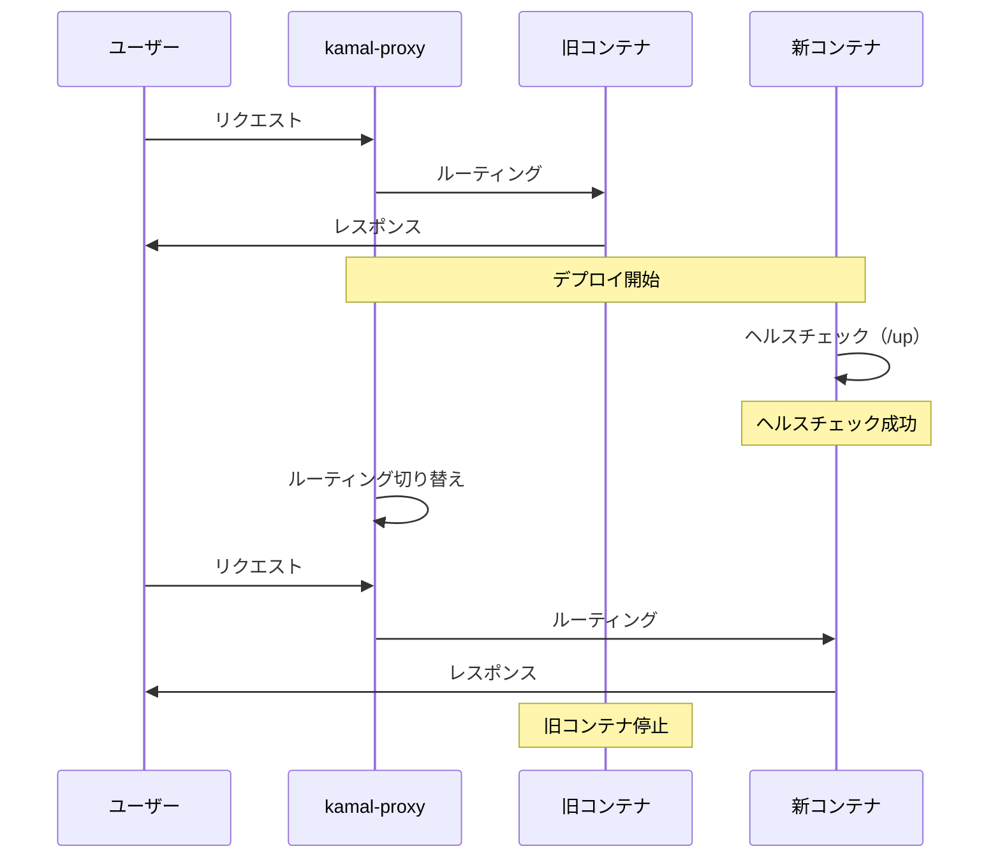

# Kamalによるモダンなデプロイフロー

**難易度**: 🟡🔴 中級〜上級
**推定学習時間**: 2〜3時間
**対応する日報**: Day 13, Day 14
**関連PR**: 初回デプロイ、独自ドメイン・SSL設定

---

## 🎯 学習目標

この教材を学ぶことで、以下ができるようになります：

- Kamalを使ったモダンなデプロイフローを理解する
- Dockerコンテナベースのデプロイを実践できる
- SSL/TLS証明書の自動取得・更新を設定できる
- ゼロダウンタイムデプロイを実現できる
- 環境変数の適切な管理方法を理解する
- PostgreSQL + Dockerコンテナの接続設定ができる

---

## 📚 前提知識

この教材を理解するには、以下の知識が必要です：

- **Dockerの基本概念**（コンテナ、イメージ、ボリューム）
- **Linuxの基本コマンド**（ssh, systemctl, psql など）
- **SSHの基礎知識**（公開鍵認証、sshコマンド）
- **環境変数の管理**（export, dotenv, credentials）
- **HTTPSとSSL/TLSの基礎**（証明書、暗号化）

---

## 📖 本編

### 概要

Railsアプリケーションを本番環境にデプロイする方法は多数ありますが、Kamalは**Dockerコンテナベースのモダンなデプロイツール**として注目を集めています。Kamalは37signals（Basecampの開発元）が開発した、シンプルで強力なデプロイツールです。

従来のデプロイツール（Capistrano、Heroku、AWS Elastic Beanstalkなど）と比較して、Kamalには以下の特徴があります：

**従来のデプロイツールの課題:**
- Capistranoはサーバー側の設定が複雑（Passenger、Pumaの設定、環境変数の管理など）
- Herokuは簡単だが、コストが高く、カスタマイズ性が低い
- AWS Elastic Beanstalkは学習コストが高く、設定が複雑
- 多くのツールでダウンタイムが発生する（デプロイ時にサービスが一時停止）

**Kamalの特徴:**
- **シンプルな設定**：`config/deploy.yml` 1ファイルで完結
- **ゼロダウンタイム**：古いコンテナを動かしたまま、新しいコンテナをデプロイ
- **Dockerネイティブ**：コンテナベースのため、環境の再現性が高い
- **SSL自動化**：Let's Encryptで証明書を自動取得・更新
- **コスト削減**：自前のVPSで運用できる（Herokuの1/10以下のコスト）

Typnixプロジェクトでは、Day 13-14でKamalを使ったデプロイを実装し、**独自ドメイン（typnix.com）でのHTTPS公開**を実現しました。

---

### 実装前（従来の方法）

Kamal導入前の典型的なデプロイフローは以下のようなものでした：

#### Capistranoによるデプロイ（従来型）

```ruby
# config/deploy.rb（Capistrano）
set :application, "my_app"
set :repo_url, "git@github.com:user/my_app.git"
set :deploy_to, "/var/www/my_app"

# Pumaの設定
set :puma_threads, [4, 16]
set :puma_workers, 0

# 環境変数の管理
set :default_env, {
  'DATABASE_URL' => ENV['DATABASE_URL'],
  'SECRET_KEY_BASE' => ENV['SECRET_KEY_BASE']
}

namespace :deploy do
  desc 'Restart application'
  task :restart do
    on roles(:app), in: :sequence, wait: 5 do
      execute :touch, release_path.join('tmp/restart.txt')
    end
  end

  after :publishing, :restart
end
```

**問題点:**
- **サーバー側の設定が複雑**：Nginx、Puma、systemdサービスの設定が必要
- **ダウンタイムの発生**：`tmp/restart.txt` を作成してPumaを再起動するため、数秒〜数十秒のダウンタイム
- **環境変数の管理が煩雑**：dotenvファイル、systemd環境ファイル、Capistranoスクリプトなど、複数箇所に分散
- **SSL証明書の手動管理**：Let's Encryptの更新を手動で設定（cron jobなど）
- **ロールバックが困難**：失敗時に手動で前のバージョンに戻す必要がある

#### Herokuによるデプロイ（PaaS型）

```bash
# Herokuへのデプロイ
git push heroku main

# 環境変数の設定
heroku config:set DATABASE_URL=postgres://...
heroku config:set SECRET_KEY_BASE=...

# マイグレーション
heroku run rails db:migrate
```

**問題点:**
- **コストが高い**：月額$25〜（Basicプラン）、本格的な運用では月額$250〜
- **カスタマイズ性が低い**：Herokuの仕様に縛られる（PostgreSQL、Redisなど）
- **パフォーマンスの上限**：スケーリングにコストがかかる
- **ベンダーロックイン**：Heroku固有の機能に依存すると、移行が困難

---

### 実装後（Kamalによるモダンなデプロイ）

Kamalを使ったデプロイでは、1つの設定ファイル（`config/deploy.yml`）でデプロイ全体を管理します。

#### config/deploy.yml の全体構成

```yaml
# Name of your application. Used to uniquely configure containers.
service: flexitype

# Name of the container image (use your-user/app-name on external registries).
image: flexitype

# Deploy to these servers.
servers:
  web:
    - 153.120.65.157
  # job:
  #   hosts:
  #     - 153.120.65.157
  #   cmd: bin/jobs

# Enable SSL auto certification via Let's Encrypt and allow for multiple apps on a single web server.
# If used with Cloudflare, set encryption mode in SSL/TLS setting to "Full" to enable CF-to-app encryption.
#
# Using an SSL proxy like this requires turning on config.assume_ssl and config.force_ssl in production.rb!
#
# Don't use this when deploying to multiple web servers (then you have to terminate SSL at your load balancer).
#
# Full SSL設定: kamal-proxyがLet's Encryptで自動的にSSL証明書を取得
# CloudflareのSSL/TLS暗号化モードは「Full」に設定すること
proxy:
  ssl: true
  host: typnix.com

# Where you keep your container images.
# ローカルでビルドしてVPSに直接送信する場合はlocalhostのまま
# Docker Hub等を使う場合はコメントを外して設定してください
registry:
  # Alternatives: hub.docker.com / registry.digitalocean.com / ghcr.io / ...
  server: localhost:5555

  # Docker Hub等の外部レジストリを使う場合
  # username: your-docker-username
  # password:
  #   - KAMAL_REGISTRY_PASSWORD

# Inject ENV variables into containers (secrets come from .kamal/secrets).
env:
  secret:
    - RAILS_MASTER_KEY
    - FLEXITYPE_DATABASE_PASSWORD
    - ADMIN_EMAILS
    - ALLOWED_EMAILS
    - GTM_CONTAINER_ID
    - GOOGLE_ADSENSE_PUBLISHER_ID
  clear:
    # Run the Solid Queue Supervisor inside the web server's Puma process to do jobs.
    # When you start using multiple servers, you should split out job processing to a dedicated machine.
    # 一旦無効化（バックグラウンドジョブを使っていないため）
    SOLID_QUEUE_IN_PUMA: false

    # Set number of processes dedicated to Solid Queue (default: 1)
    # JOB_CONCURRENCY: 3

    # Set number of cores available to the application on each server (default: 1).
    # WEB_CONCURRENCY: 2

    # PostgreSQL接続設定（VPS上でPostgreSQLを直接稼働させる場合）
    # Dockerコンテナからホストに接続するため、VPSのIPアドレスを指定
    DB_HOST: 153.120.65.157

    # Log everything from Rails (本番環境では info または warn 推奨)
    RAILS_LOG_LEVEL: info

# Aliases are triggered with "bin/kamal <alias>". You can overwrite arguments on invocation:
# "bin/kamal logs -r job" will tail logs from the first server in the job section.
aliases:
  console: app exec --interactive --reuse "bin/rails console"
  shell: app exec --interactive --reuse "bash"
  logs: app logs -f
  dbc: app exec --interactive --reuse "bin/rails dbconsole --include-password"

# Use a persistent storage volume for sqlite database files and local Active Storage files.
# Recommended to change this to a mounted volume path that is backed up off server.
volumes:
  - "flexitype_storage:/rails/storage"

# Bridge fingerprinted assets, like JS and CSS, between versions to avoid
# hitting 404 on in-flight requests. Combines all files from new and old
# version inside the asset_path.
asset_path: /rails/public/assets

# Configure the image builder.
builder:
  arch: amd64

  # # Build image via remote server (useful for faster amd64 builds on arm64 computers)
  # remote: ssh://docker@docker-builder-server
  #
  # # Pass arguments and secrets to the Docker build process
  # args:
  #   RUBY_VERSION: 3.4.4
  # secrets:
  #   - GITHUB_TOKEN
  #   - RAILS_MASTER_KEY

# Use a different ssh user than root
ssh:
  user: ubuntu

# Use accessory services (secrets come from .kamal/secrets).
# accessories:
#   db:
#     image: mysql:8.0
#     host: 192.168.0.2
#     # Change to 3306 to expose port to the world instead of just local network.
#     port: "127.0.0.1:3306:3306"
#     env:
#       clear:
#         MYSQL_ROOT_HOST: '%'
#       secret:
#         - MYSQL_ROOT_PASSWORD
#     files:
#       - config/mysql/production.cnf:/etc/mysql/my.cnf
#       - db/production.sql:/docker-entrypoint-initdb.d/setup.sql
#     directories:
#       - data:/var/lib/mysql
#   redis:
#     image: valkey/valkey:8
#     host: 192.168.0.2
#     port: 6379
#     directories:
#       - data:/data
```

#### .kamal/secrets の設定（Git管理外）

`.kamal/secrets` ファイルは**絶対にGitにコミットしない**重要な設定ファイルです。

```bash
# ========================================
# セキュリティ関連（最重要）
# ========================================

# 管理者のメールアドレス（カンマ区切り）
# 管理画面（/admin）へのアクセスを許可するメールアドレス
# 公式レッスン用アカウントも含める
ADMIN_EMAILS=admin@example.com,official@example.com

# ========================================
# データベース関連
# ========================================

# PostgreSQLデータベースのパスワード
# VPS上で設定したPostgreSQLユーザー "flexitype" のパスワード
FLEXITYPE_DATABASE_PASSWORD=your_database_password_here

# ========================================
# Rails暗号化
# ========================================

# Rails暗号化キー（config/master.key の内容）
RAILS_MASTER_KEY=your_rails_master_key_here

# ========================================
# アクセス制御
# ========================================

# ログイン許可するメールアドレス（カンマ区切り）
# アプリへのログインを許可するメールアドレス（ベータテストユーザー）
# 公式レッスン用アカウントも含める
ALLOWED_EMAILS=user1@example.com,user2@example.com,official@example.com

# ========================================
# 外部サービス
# ========================================

# Google Tag Manager コンテナID
GTM_CONTAINER_ID=GTM-XXXXXXX

# Google AdSense パブリッシャーID
# サイト所有権確認用のメタタグに使用
GOOGLE_ADSENSE_PUBLISHER_ID=ca-pub-XXXXXXXXXXXXXXXX
```

#### デプロイコマンド（初回）

```bash
# 初回セットアップ（環境構築）
bin/kamal setup

# 2回目以降のデプロイ
bin/kamal deploy
```

**改善点:**
- ✅ **ゼロダウンタイム**：古いコンテナを動かしたまま、新しいコンテナをデプロイ（ローリングデプロイ）
- ✅ **SSL自動化**：Let's Encryptで証明書を自動取得・更新（90日ごと）
- ✅ **環境変数の一元管理**：`.kamal/secrets` と `config/deploy.yml` で完結
- ✅ **簡潔な設定**：Nginx、Puma、systemdの設定が不要（kamal-proxyが担当）
- ✅ **ロールバック機能**：`bin/kamal rollback` で前のバージョンに即座に戻せる
- ✅ **デプロイログの可視化**：`bin/kamal app logs -f` でリアルタイムログ確認

**コスト削減効果:**
- Heroku Basic（月額$25）→ さくらVPS（月額1,000円〜） = **約75%削減**
- Heroku Standard（月額$250）→ さくらVPS（月額5,000円〜） = **約80%削減**

---

### 解説

#### なぜKamalが優れているのか

Kamalがモダンなデプロイツールとして優れている理由を、5つのポイントで解説します。

**1. ゼロダウンタイムデプロイ（ローリングデプロイ）**

Kamalは**ローリングデプロイ**方式を採用しており、デプロイ中もサービスが継続して稼働します。



**ヘルスチェックの仕組み:**
- Kamalは新しいコンテナをデプロイする前に、`/up` エンドポイントにアクセス
- レスポンスが200 OKの場合のみ、ルーティングを切り替え
- ヘルスチェックが失敗した場合、旧コンテナのまま稼働（ダウンタイムゼロ）

**Typnixでのヘルスチェック設定:**

```ruby
# config/routes.rb
Rails.application.routes.draw do
  # ヘルスチェックエンドポイント（Kamal用）
  get "up" => "rails/health#show", as: :rails_health_check
end
```

このエンドポイントは、Rails 8で標準搭載されています。

**2. SSL/TLS証明書の自動取得・更新（Let's Encrypt）**

Kamalの`kamal-proxy`コンポーネントは、**Let's Encryptとの統合**を提供しており、SSL証明書の取得・更新を完全に自動化します。

```yaml
# config/deploy.yml
proxy:
  ssl: true            # SSL有効化
  host: typnix.com     # ドメイン名を指定
```

この設定だけで、以下が自動的に実行されます：

1. **初回デプロイ時**：Let's Encryptに証明書をリクエスト
2. **証明書取得**：ドメイン所有権の確認（HTTP-01チャレンジ）
3. **証明書のインストール**：kamal-proxyに証明書を配置
4. **自動更新**：証明書の有効期限が近づくと、自動的に更新（90日ごと）

**従来の方法（Certbot）との比較:**

```bash
# 従来の方法（Certbot）
sudo certbot certonly --webroot -w /var/www/html -d typnix.com
sudo certbot renew --dry-run

# cron jobで自動更新を設定
0 0 1 * * sudo certbot renew --quiet
```

Kamalでは、この設定が**一切不要**です。

**CloudflareとLet's Encryptの組み合わせ（エンドツーエンド暗号化）**

Typnixでは、CloudflareとLet's Encryptを組み合わせて、**エンドツーエンド暗号化**を実現しています。

```
ブラウザ → Cloudflare → VPS（kamal-proxy）
  HTTPS        HTTPS        HTTPS
  (CF証明書)   (Let's Encrypt)
```

**Cloudflare設定:**
- SSL/TLS暗号化モード: **Full**（Cloudflare ↔ VPS間もHTTPS）
- Flexibleモードは**使用しない**（セキュリティ上の問題）

**Rails設定:**

```ruby
# config/environments/production.rb
config.assume_ssl = true   # プロキシ経由でSSL接続されていると仮定
config.force_ssl = true    # すべてのアクセスをHTTPSに強制
```

**3. 環境変数の適切な管理（Git管理内/外の分離）**

Kamalは環境変数を2つのカテゴリに分けて管理します：

- **`env.secret`**：`.kamal/secrets` ファイルから読み込む（**Git管理外**）
- **`env.clear`**：`config/deploy.yml` に直接記載（**Git管理内**）

```yaml
# config/deploy.yml
env:
  secret:
    - RAILS_MASTER_KEY              # 機密情報（Git管理外）
    - FLEXITYPE_DATABASE_PASSWORD   # 機密情報（Git管理外）
    - ALLOWED_EMAILS                # 機密情報（Git管理外）
  clear:
    DB_HOST: 153.120.65.157         # 公開情報（Git管理内）
    RAILS_LOG_LEVEL: info           # 公開情報（Git管理内）
```

**セキュリティのベストプラクティス:**

| 情報の種類 | 管理方法 | 例 |
|----------|---------|---|
| **機密情報** | `.kamal/secrets`（Git管理外） | パスワード、API キー、メールアドレス |
| **公開情報** | `config/deploy.yml`（Git管理内） | IPアドレス、ログレベル、ホスト名 |

`.kamal/secrets` ファイルは、`.gitignore` に含めて、**絶対にGitにコミットしない**ようにします。

```bash
# .gitignore
/.kamal/secrets
/config/master.key
```

**環境変数の反映方法:**

```bash
# 環境変数を変更した場合
bin/kamal app boot

# または、デプロイ
bin/kamal deploy
```

`bin/kamal app boot` は、コンテナを再起動して、新しい環境変数を反映します。

**4. Dockerネットワーキングの理解（コンテナとホストの通信）**

Kamalでは、Railsアプリケーションは**Dockerコンテナ内**で動作します。一方、PostgreSQLなどのデータベースは**VPSホスト上**で動作することが多いです。

この場合、**Dockerコンテナ内の`localhost`は、コンテナ自身を指す**ため、VPS上のPostgreSQLに接続できません。

**問題のあるコード:**

```yaml
# config/deploy.yml（誤った設定）
env:
  clear:
    DB_HOST: localhost  # ❌ コンテナ内のlocalhostを指す
```

この設定では、Dockerコンテナ内のRailsアプリが、コンテナ内のlocalhostに接続しようとしますが、PostgreSQLはVPSホスト上で動いているため、接続エラーになります。

**正しいコード:**

```yaml
# config/deploy.yml（正しい設定）
env:
  clear:
    DB_HOST: 153.120.65.157  # ✅ VPSのIPアドレスを指定
```

**Dockerネットワーキングの概念:**

```
┌─────────────────────────────────────┐
│ VPS（153.120.65.157）                │
│                                     │
│  ┌───────────────────────────┐     │
│  │ Dockerコンテナ              │     │
│  │ （Railsアプリ）               │     │
│  │                            │     │
│  │ localhost → 172.17.0.2     │     │
│  └───────────────────────────┘     │
│              ↑                      │
│              │ DB_HOST=153.120.65.157
│              ↓                      │
│  ┌───────────────────────────┐     │
│  │ PostgreSQL                  │     │
│  │ （VPSホスト上で稼働）          │     │
│  │ localhost → 153.120.65.157 │     │
│  └───────────────────────────┘     │
└─────────────────────────────────────┘
```

**PostgreSQL側の設定（pg_hba.conf）**

VPS上のPostgreSQLは、Dockerネットワークからの接続を許可する必要があります。

```bash
# /etc/postgresql/14/main/pg_hba.conf（VPS上）
# Dockerネットワークからの接続を許可
host    all             all             172.16.0.0/12           md5
```

Dockerコンテナは、`172.16.0.0/12` の範囲でIPアドレスを取得するため、このネットワーク範囲からの接続を許可します。

**PostgreSQL接続リスナーの設定（postgresql.conf）**

```bash
# /etc/postgresql/14/main/postgresql.conf（VPS上）
listen_addresses = '*'  # すべてのIPアドレスからの接続をリッスン
```

**設定反映:**

```bash
# PostgreSQLを再起動
sudo systemctl restart postgresql
```

**Day 13のトラブルシューティング:**

> Dockerコンテナ内の`localhost`はコンテナ自身を指す。ホストマシン（VPS）のサービスに接続するにはホストのIPアドレスを使用。Dockerネットワークは動的にIPを割り当てるため、ネットワーク範囲全体を許可する必要がある。

**5. kamal-proxyによる柔軟なルーティング**

Kamalの`kamal-proxy`コンポーネントは、Nginxの代わりとなる軽量なHTTPプロキシです。

**kamal-proxyの主な機能:**

- **ホストベースルーティング**：`Host`ヘッダーでルーティング先を判断
- **SSL終端**：Let's Encrypt証明書を自動取得・更新
- **ヘルスチェック**：新しいコンテナが正常に起動したか確認
- **ローリングデプロイ**：古いコンテナから新しいコンテナへシームレスに切り替え

**ホストベースルーティングの例:**

```yaml
# config/deploy.yml
proxy:
  ssl: true
  host: typnix.com  # このホスト名でのみルーティング
```

この設定により、以下の挙動になります：

- `https://typnix.com/` → Railsアプリにルーティング ✅
- `http://153.120.65.157/` → 404エラー ❌（ホスト名が一致しない）

**セキュリティ上のメリット:**
- IPアドレス直接アクセスを防ぐ（ドメイン経由でのみアクセス可能）
- 複数のアプリを1つのVPSで運用できる（ホスト名で振り分け）

---

#### 実装のポイント

Kamalを使ったデプロイを成功させるために、重要なポイントを解説します。

**1. デプロイ前のチェックリスト**

デプロイ前に、以下のチェックを実施します：

```bash
# ローカル環境でのチェック
bundle exec rubocop           # コード品質チェック
bundle exec brakeman --no-pager  # セキュリティ脆弱性チェック

# VPS環境でのチェック
ssh ubuntu@153.120.65.157 "docker --version"       # Dockerがインストールされているか
ssh ubuntu@153.120.65.157 "sudo systemctl status postgresql"  # PostgreSQLが起動しているか
```

Typnixプロジェクトでは、Day 13で`scripts/pre_deploy_check.sh`（140行）を作成し、これらのチェックを自動化しました。

**2. VPSのセットアップ（初回のみ）**

Kamalを使う前に、VPS側の準備が必要です。

```bash
# VPSにSSH接続
ssh ubuntu@153.120.65.157

# Dockerのインストール
curl -fsSL https://get.docker.com -o get-docker.sh
sudo sh get-docker.sh

# ユーザーをdockerグループに追加
sudo usermod -aG docker ubuntu

# ログアウト・再ログインして変更を反映
exit
ssh ubuntu@153.120.65.157

# Dockerの動作確認
docker --version
```

**PostgreSQLのセットアップ:**

```bash
# PostgreSQLのインストール（Ubuntu 22.04）
sudo apt update
sudo apt install postgresql postgresql-contrib

# PostgreSQLの起動確認
sudo systemctl status postgresql

# PostgreSQLユーザーとデータベースの作成
sudo -u postgres psql

-- PostgreSQLコンソール内で実行
CREATE USER flexitype WITH PASSWORD 'your-secure-password';
CREATE DATABASE flexitype_production OWNER flexitype;
CREATE DATABASE flexitype_production_cache OWNER flexitype;
CREATE DATABASE flexitype_production_queue OWNER flexitype;
CREATE DATABASE flexitype_production_cable OWNER flexitype;
\q
```

Typnixプロジェクトでは、Day 13で`scripts/vps_setup.sh`（97行）を作成し、VPSセットアップを自動化しました。

**3. ファイアウォール設定（さくらVPSの二重ファイアウォール）**

さくらVPSでは、**OS側（ufw）とコントロールパネル側（パケットフィルタ）の両方**を設定する必要があります。

**OS側（ufw）:**

```bash
# VPS上で実行
sudo ufw allow OpenSSH
sudo ufw allow 80/tcp    # HTTP
sudo ufw allow 443/tcp   # HTTPS
sudo ufw enable
```

**コントロールパネル側（パケットフィルタ）:**

さくらVPSのコントロールパネルで、「パケットフィルタ」を設定します。

1. 「Webルール」を追加（80, 443番ポート）
2. 「SSHルール」を追加（22番ポート）

**Day 13のトラブルシューティング:**

> VPS側のufwは開けたが、さくらVPSのパケットフィルタで80/443ポートが閉じていたため、外部アクセスができなかった。さくらVPSでは、OS側とコントロールパネル側の両方を設定する必要がある。

**4. デプロイコマンドの使い分け**

Kamalには、複数のデプロイコマンドがあります。

| コマンド | 用途 | タイミング |
|---------|------|----------|
| `bin/kamal setup` | 初回セットアップ | VPSへの初回デプロイ |
| `bin/kamal deploy` | 通常のデプロイ | コード変更後のデプロイ |
| `bin/kamal app boot` | コンテナ再起動 | 環境変数変更後 |
| `bin/kamal rollback` | ロールバック | デプロイ失敗時 |
| `bin/kamal app logs -f` | ログ確認 | デプロイ後の動作確認 |

**初回デプロイ（Day 13）:**

```bash
# 初回セットアップ
bin/kamal setup

# データベースマイグレーション
bin/kamal app exec 'bin/rails db:migrate'
bin/kamal app exec 'bin/rails db:migrate:cache'
bin/kamal app exec 'bin/rails db:migrate:queue'
bin/kamal app exec 'bin/rails db:migrate:cable'
```

**2回目以降のデプロイ（Day 14以降）:**

```bash
# 変更をコミット
git add .
git commit -m "変更内容"

# デプロイ
bin/kamal deploy

# ログ確認
bin/kamal app logs -f
```

**環境変数変更時（Day 14）:**

```bash
# .kamal/secrets を編集
vim .kamal/secrets

# コンテナを再起動して環境変数を反映
bin/kamal app boot
```

**5. トラブルシューティングのアプローチ**

デプロイが失敗した場合、以下の手順でデバッグします。

**Step 1: ログの確認**

```bash
# アプリケーションログ
bin/kamal app logs

# リアルタイムログ
bin/kamal app logs -f
```

**Step 2: コンテナの状態確認**

```bash
# VPSにSSH接続
ssh ubuntu@153.120.65.157

# コンテナ一覧
docker ps -a

# コンテナのログ
docker logs flexitype-web-<container-id>
```

**Step 3: データベース接続テスト**

```bash
# Railsコンソールで接続確認
bin/kamal app exec --interactive --reuse "bin/rails console"

# コンソール内で実行
ActiveRecord::Base.connection.execute("SELECT 1")
```

**Step 4: ヘルスチェックエンドポイントのテスト**

```bash
# VPS内部からヘルスチェック
ssh ubuntu@153.120.65.157
curl http://localhost/up
```

**Day 13のトラブルシューティング例:**

| 問題 | 原因 | 解決方法 |
|------|------|----------|
| データベース接続エラー | Dockerコンテナ内のlocalhostがVPSを指さない | DB_HOSTをVPS IPアドレスに変更 |
| pg_hba.conf接続拒否 | Dockerネットワークからの接続が未許可 | 172.16.0.0/12を許可に追加 |
| 外部アクセス不可 | さくらVPSのパケットフィルタ設定不足 | Webルール（80, 443）を追加 |

---

### Typnixプロジェクトでの実例

Typnixプロジェクトでは、Day 13-14でKamalを使ったデプロイを実装しました。実際のデプロイフローを、時系列で解説します。

#### Day 13: 初回デプロイ（HTTP接続）

**目標**: VPSでTypnixを外部公開する（HTTP接続、IPアドレスアクセス）

**ステップ1: デプロイ準備**

```bash
# ローカル環境でデプロイドキュメント作成
docs/deployment_guide.md       # 310行
.kamal/secrets.example         # 環境変数テンプレート
scripts/pre_deploy_check.sh    # 140行（自動チェックスクリプト）
scripts/vps_setup.sh           # 97行（VPSセットアップスクリプト）
```

**ステップ2: VPSセットアップ**

```bash
# VPSにSSH接続
ssh ubuntu@153.120.65.157

# scripts/vps_setup.sh を実行（Docker、PostgreSQLをインストール）
./scripts/vps_setup.sh
```

**ステップ3: PostgreSQL設定**

```bash
# PostgreSQLデータベース作成
sudo -u postgres psql
CREATE USER flexitype WITH PASSWORD 'your-secure-password';
CREATE DATABASE flexitype_production OWNER flexitype;
CREATE DATABASE flexitype_production_cache OWNER flexitype;
CREATE DATABASE flexitype_production_queue OWNER flexitype;
CREATE DATABASE flexitype_production_cable OWNER flexitype;
\q

# pg_hba.conf編集（Dockerネットワークからの接続を許可）
sudo vim /etc/postgresql/14/main/pg_hba.conf
# 追加: host    all             all             172.16.0.0/12           md5

# postgresql.conf編集（リスナー設定）
sudo vim /etc/postgresql/14/main/postgresql.conf
# 変更: listen_addresses = '*'

# PostgreSQL再起動
sudo systemctl restart postgresql
```

**ステップ4: config/deploy.yml設定（初回）**

```yaml
# config/deploy.yml（Day 13時点、HTTP接続）
service: flexitype
image: flexitype

servers:
  web:
    - 153.120.65.157

# SSL無効（初回はHTTPで確認）
proxy:
  ssl: false
  # host: typnix.com  # コメントアウト（IPアドレスでアクセス）

registry:
  server: localhost:5555

env:
  secret:
    - RAILS_MASTER_KEY
    - FLEXITYPE_DATABASE_PASSWORD
  clear:
    SOLID_QUEUE_IN_PUMA: false
    DB_HOST: 153.120.65.157
    RAILS_LOG_LEVEL: info

ssh:
  user: ubuntu
```

**ステップ5: .kamal/secrets作成**

```bash
# .kamal/secrets（Git管理外）
RAILS_MASTER_KEY=xxxxxxxxxxxxxxxxxxxxxxxxxxxxx
FLEXITYPE_DATABASE_PASSWORD=your-secure-password
```

**ステップ6: 初回デプロイ**

```bash
# 初回セットアップ
bin/kamal setup

# データベースマイグレーション
bin/kamal app exec 'bin/rails db:migrate'
bin/kamal app exec 'bin/rails db:migrate:cache'
bin/kamal app exec 'bin/rails db:migrate:queue'
bin/kamal app exec 'bin/rails db:migrate:cable'

# ログ確認
bin/kamal app logs -f
```

**ステップ7: 動作確認**

```bash
# VPS内部からヘルスチェック
ssh ubuntu@153.120.65.157
curl http://localhost/up
# → 200 OK

# 外部からアクセス（ブラウザで確認）
# http://153.120.65.157/
# → Typnixが表示される！
```

**結果:**
- ✅ HTTP接続でTypnixが外部公開された
- ✅ データベース接続成功
- ✅ ヘルスチェック成功

**発生した問題と解決:**

| 問題 | 解決方法 |
|------|----------|
| データベース接続エラー | DB_HOSTをVPS IPアドレスに変更 |
| pg_hba.conf接続拒否 | 172.16.0.0/12を許可に追加 |
| 外部アクセス不可 | さくらVPSのパケットフィルタでWebルール追加 |

#### Day 14: 独自ドメイン + SSL/HTTPS化

**目標**: 独自ドメイン（typnix.com）でHTTPS接続を実現する

**ステップ1: Cloudflare設定**

```
# CloudflareでDNS設定
タイプ: A
名前: @
IPv4アドレス: 153.120.65.157
プロキシ: 有効（オレンジクラウド）

# SSL/TLS暗号化モード: Full
（Cloudflare ↔ VPS間もHTTPS）
```

**ステップ2: config/deploy.yml更新（SSL有効化）**

```yaml
# config/deploy.yml（Day 14時点、HTTPS接続）
proxy:
  ssl: true            # false → true に変更
  host: typnix.com     # ドメイン名を指定
```

**ステップ3: Rails設定（HTTPS強制）**

```ruby
# config/environments/production.rb
config.assume_ssl = true   # プロキシ経由でSSL接続されていると仮定
config.force_ssl = true    # すべてのアクセスをHTTPSに強制
```

**ステップ4: デプロイ**

```bash
# デプロイ
bin/kamal deploy

# ログ確認
bin/kamal app logs -f
```

**結果:**
- ✅ https://typnix.com/ でアクセス成功
- ✅ Let's Encrypt証明書の自動取得成功
- ✅ エンドツーエンド暗号化（ブラウザ → Cloudflare → VPS）
- ✅ HTTP → HTTPSへの自動リダイレクト
- ✅ http://153.120.65.157/ は404（意図通り、ホストベースルーティング）

**Day 14のトラブルシューティング:**

| 問題 | 原因 | 解決方法 |
|------|------|----------|
| Cloudflare SSL設定で接続不可 | SSL/TLS設定を「Flexible」にした | 「Full」に変更 |
| ログイン後にアクセス拒否 | `ALLOWED_EMAILS`が空文字列 | `.kamal/secrets`にメールアドレスを追加し、`bin/kamal app boot`で反映 |

**ステップ5: 環境変数の移動（セキュリティ改善）**

Day 14では、`ALLOWED_EMAILS`を`config/deploy.yml`から`.kamal/secrets`に移動しました。

**Before（Day 13）:**

```yaml
# config/deploy.yml（Git管理内）
env:
  clear:
    ALLOWED_EMAILS: ""  # ❌ Git管理されている
```

**After（Day 14）:**

```yaml
# config/deploy.yml（Git管理内）
env:
  secret:
    - ALLOWED_EMAILS  # ✅ .kamal/secretsから読み込む
```

```bash
# .kamal/secrets（Git管理外）
ALLOWED_EMAILS=user@gmail.com
```

**環境変数の反映:**

```bash
# コンテナを再起動して環境変数を反映
bin/kamal app boot
```

#### Day 28: ALLOWED_EMAILSのDB化（フィーチャーフラグパターン）

Day 28では、運用効率化のために`ALLOWED_EMAILS`をデータベース（AllowedEmailモデル）に移行しました。

**目的:**
- VPS環境変数の編集 → コンテナ再起動が不要
- 管理者画面（`/admin/allowed_emails`）で簡単に追加・削除
- フィーチャーフラグパターンで削除容易性を確保

**フィーチャーフラグパターン:**

```ruby
# app/controllers/application_controller.rb
def logged_in?
  return false unless session[:user_id]

  # フィーチャーフラグ: RESTRICT_LOGIN環境変数で制御
  if ENV["RESTRICT_LOGIN"] == "true"
    # 許可リストチェック（AllowedEmailモデル）
    user = User.find_by(id: session[:user_id])
    return false unless user
    return false unless AllowedEmail.allowed?(user.email)
  end

  true
end
```

**環境変数（.kamal/secrets）:**

```bash
# .kamal/secrets
# RESTRICT_LOGIN=true にすると、許可リストチェックが有効化
RESTRICT_LOGIN=true

# ALLOWED_EMAILS は削除（DB管理に移行）
# ALLOWED_EMAILS=user@gmail.com  ← 削除
```

**デプロイ:**

```bash
# 環境変数を変更した場合
bin/kamal app boot

# または、通常のデプロイ
bin/kamal deploy
```

このフィーチャーフラグパターンにより、将来的に許可リスト機能を削除する場合、`RESTRICT_LOGIN=false`に変更するだけで無効化できます。

---

## 💡 まとめ

### 重要ポイント

- ✅ **Kamalはゼロダウンタイムデプロイを実現**：ヘルスチェック + ローリングデプロイ
- ✅ **SSL/TLS証明書の自動取得・更新**：Let's Encryptとの統合、90日ごとの自動更新
- ✅ **環境変数の適切な管理**：`.kamal/secrets`（Git管理外）と`config/deploy.yml`（Git管理内）の使い分け
- ✅ **Dockerネットワーキングの理解**：コンテナ内の`localhost`はコンテナ自身を指す、VPSのIPアドレスを使用
- ✅ **kamal-proxyの柔軟なルーティング**：ホストベースルーティング、SSL終端、ヘルスチェック
- ✅ **トラブルシューティングのアプローチ**：ログ確認、コンテナ状態確認、データベース接続テスト、ヘルスチェック
- ✅ **コスト削減**：Herokuと比較して約75-80%のコスト削減

### ベストプラクティス

**1. セキュリティ:**
- `.kamal/secrets` は絶対にGitにコミットしない
- `config/master.key` もGitにコミットしない
- PostgreSQLのパスワードは強力なものを使用
- SSH鍵認証を使用（パスワード認証は無効化）
- ファイアウォール（ufw）で不要なポートを閉じる

**2. デプロイ前のチェック:**
- `bundle exec rubocop` でコード品質を確認
- `bundle exec brakeman` でセキュリティ脆弱性を確認
- ローカル環境でテストを実行
- VPSの動作確認（Docker、PostgreSQL）

**3. デプロイ後の動作確認:**
- `bin/kamal app logs -f` でログを確認
- ブラウザでアクセスして動作確認
- ヘルスチェックエンドポイント（`/up`）を確認

**4. トラブルシューティング:**
- ログを最初に確認（`bin/kamal app logs`）
- コンテナの状態を確認（`docker ps -a`）
- データベース接続をテスト（`bin/kamal app exec --interactive "bin/rails console"`）
- 環境変数を確認（`bin/kamal app exec "env | sort"`）

**5. 運用:**
- 定期的なバックアップ（PostgreSQL、ストレージ）
- SSL証明書の更新確認（自動更新されているか）
- ログのローテーション設定
- モニタリング・アラート設定（将来実装）

### 次のステップ

このトピックを理解したら、以下に進むことをお勧めします：

- **フィーチャーフラグパターン**（環境変数による機能制御、削除容易性の確保）
- **データベースバックアップ自動化**（cron設定、7日間保持）
- **エラートラッキング**（Sentry導入、本番環境のエラー監視）
- **パフォーマンス監視**（New Relic、Datadog など）

---

## 🔗 関連教材

- [フィーチャーフラグパターン](./12_feature_flag_pattern.md)
- [セキュリティベストプラクティス](./13_security_best_practices.md)
- [Dockerネットワーキング基礎](../../01_basics/05_docker_networking.md)
- [レビューテスト](../../reviews/review_11_kamal_deployment.md)

---

## 📝 演習問題

### 問題1: config/deploy.ymlの基本設定

以下の要件を満たす`config/deploy.yml`を作成してください。

**要件:**
- サービス名: `my_app`
- デプロイ先: 192.168.1.100（webサーバー）
- SSL有効化、ドメイン: example.com
- 環境変数:
  - `RAILS_MASTER_KEY`（secret）
  - `DATABASE_PASSWORD`（secret）
  - `DB_HOST: 192.168.1.100`（clear）

<details>
<summary>解答例を表示</summary>

```yaml
service: my_app
image: my_app

servers:
  web:
    - 192.168.1.100

proxy:
  ssl: true
  host: example.com

registry:
  server: localhost:5555

env:
  secret:
    - RAILS_MASTER_KEY
    - DATABASE_PASSWORD
  clear:
    DB_HOST: 192.168.1.100

ssh:
  user: ubuntu
```

**解説:**
- `service`と`image`は同じ名前でOK（ローカルレジストリの場合）
- `proxy.ssl: true`でSSL有効化、Let's Encryptが自動取得
- `env.secret`には機密情報、`env.clear`には公開情報を配置
- `ssh.user`はVPSのユーザー名（rootではない）

</details>

---

### 問題2: PostgreSQL接続設定

Dockerコンテナ内のRailsアプリから、VPS上のPostgreSQLに接続したい。以下の設定ファイルを完成させてください。

**要件:**
- VPS IP: 192.168.1.100
- PostgreSQLユーザー: myapp
- PostgreSQLデータベース: myapp_production
- Dockerネットワーク: 172.16.0.0/12

<details>
<summary>解答例を表示</summary>

**config/deploy.yml:**

```yaml
env:
  secret:
    - MYAPP_DATABASE_PASSWORD
  clear:
    DB_HOST: 192.168.1.100  # VPSのIPアドレスを指定
```

**config/database.yml:**

```yaml
production:
  adapter: postgresql
  encoding: unicode
  pool: <%= ENV.fetch("RAILS_MAX_THREADS") { 5 } %>
  host: <%= ENV.fetch("DB_HOST") { "localhost" } %>
  port: 5432
  database: myapp_production
  username: myapp
  password: <%= ENV['MYAPP_DATABASE_PASSWORD'] %>
```

**VPS上の/etc/postgresql/14/main/pg_hba.conf:**

```bash
# Dockerネットワークからの接続を許可
host    all             all             172.16.0.0/12           md5
```

**VPS上の/etc/postgresql/14/main/postgresql.conf:**

```bash
listen_addresses = '*'
```

**PostgreSQL再起動:**

```bash
sudo systemctl restart postgresql
```

**解説:**
- Dockerコンテナ内の`localhost`はコンテナ自身を指すため、VPSのIPアドレスを使用
- `pg_hba.conf`でDockerネットワーク範囲（172.16.0.0/12）からの接続を許可
- `postgresql.conf`の`listen_addresses = '*'`でリスナーを有効化

</details>

---

### 問題3: SSL/HTTPS設定（Cloudflare + Let's Encrypt）

Cloudflare経由でエンドツーエンド暗号化を実現したい。以下の設定を完成させてください。

**要件:**
- ドメイン: example.com
- CloudflareのSSL/TLS暗号化モード: Full
- Rails側でHTTPS強制

<details>
<summary>解答例を表示</summary>

**Cloudflare設定:**

1. DNS設定:
   - タイプ: A
   - 名前: @
   - IPv4アドレス: 192.168.1.100
   - プロキシ: 有効（オレンジクラウド）

2. SSL/TLS設定:
   - 暗号化モード: **Full**（Cloudflare ↔ VPS間もHTTPS）

**config/deploy.yml:**

```yaml
proxy:
  ssl: true              # Let's Encrypt有効化
  host: example.com      # ドメイン名
```

**config/environments/production.rb:**

```ruby
config.assume_ssl = true   # プロキシ経由でSSL接続されていると仮定
config.force_ssl = true    # すべてのアクセスをHTTPSに強制
```

**デプロイ:**

```bash
bin/kamal deploy
```

**解説:**
- CloudflareのSSL/TLS暗号化モードを**Full**に設定（Flexible は使用しない）
- `proxy.ssl: true`でLet's Encrypt証明書を自動取得
- `config.assume_ssl = true`でプロキシ経由のSSL接続を認識
- `config.force_ssl = true`でHTTP → HTTPSへ自動リダイレクト
- 証明書は90日ごとに自動更新される

**セキュリティ:**
- ブラウザ → Cloudflare: HTTPS（Cloudflare証明書）
- Cloudflare → VPS: HTTPS（Let's Encrypt証明書）
- エンドツーエンド暗号化を実現

</details>

---

**作成日**: 2026-01-03
**難易度**: 🟡🔴 中級〜上級
**推定学習時間**: 2〜3時間
